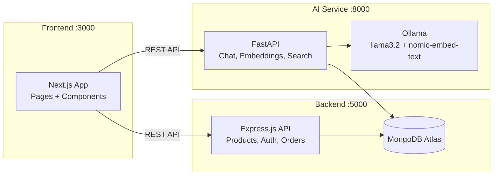

# Restructure EStoreFront into Frontend + Backend + AI Service

Split the current Next.js monolith into three independent services that communicate via REST APIs.

## Why Python for the AI Service?

| Factor | Python | JavaScript |
|---|---|---|
| LangChain ecosystem | ✅ More mature, better docs, more integrations | ⚠️ Functional but lags behind |
| ML/AI libraries | ✅ PyTorch, scikit-learn, HuggingFace, FAISS | ❌ Very limited |
| Ollama integration | ✅ Native Python SDK + LangChain | ⚠️ Works but Python is first-class |
| Vector operations | ✅ NumPy for fast cosine similarity | ⚠️ Manual JS is slower |
| Future extensibility | ✅ Fine-tuning, RAG pipelines, agents | ⚠️ Limited |
| FastAPI performance | ✅ Async, auto-docs, type-safe | N/A |
| Google Gemini SDK | ✅ `google-generativeai` Python package | ✅ Also good |

**Verdict**: Python with **FastAPI** is the clear choice for the AI service.

## User Review Required

> [!IMPORTANT]
> This restructure creates **3 separate projects** at the same level inside `Ecommerce_app/`. The existing `Ai_ecommerce/` folder will remain as-is (a reference/backup) — nothing in it is modified or deleted.

```
Ecommerce_app/
├── Ai_ecommerce/      ← existing (untouched, serves as backup)
├── frontend/          ← NEW: Next.js (UI + pages)
├── backend/           ← NEW: Express.js + TypeScript (REST API)
└── ai-service/        ← NEW: Python FastAPI (chat, search, embeddings)
```

> [!WARNING]
> The AI service requires **Python 3.10+** and **Ollama** running locally. Please confirm you have both installed, or let me know and I'll add installation steps.

---

## Proposed Changes

### Architecture



---

### Backend (Express.js + TypeScript)

#### [NEW] `backend/` — Node.js/Express REST API

| File | Purpose |
|---|---|
| [package.json](file:///c:/Users/Hp/Desktop/Ecommerce_app/Ai_ecommerce/package.json) | Express, MongoDB, TypeScript, cors, dotenv |
| [tsconfig.json](file:///c:/Users/Hp/Desktop/Ecommerce_app/Ai_ecommerce/tsconfig.json) | TypeScript configuration |
| `src/index.ts` | Express server entry (port 5000) |
| `src/config/db.ts` | MongoDB connection singleton (from [lib/ai/mongodb.ts](file:///c:/Users/Hp/Desktop/Ecommerce_app/Ai_ecommerce/src/lib/ai/mongodb.ts)) |
| `src/routes/products.ts` | `GET /api/products`, `GET /api/products/:slug`, `POST /api/products/seed` |
| `src/types/index.ts` | Product, Category, Brand, CartItem, Review types |
| `src/data/products.ts` | Product seed data (from [seed/route.ts](file:///c:/Users/Hp/Desktop/Ecommerce_app/Ai_ecommerce/src/app/api/products/seed/route.ts)) |
| `.env` | `MONGODB_URI`, `MONGODB_DB_NAME`, `PORT=5000` |

**API Endpoints:**
- `GET /api/products` — list all products (with query params for category, brand, price filtering)
- `GET /api/products/:slug` — single product by slug  
- `POST /api/products/seed` — seed products into MongoDB
- `DELETE /api/products/seed` — clear products collection

---

### AI Service (Python FastAPI)

#### [NEW] `ai-service/` — Python FastAPI

| File | Purpose |
|---|---|
| `requirements.txt` | fastapi, uvicorn, pymongo, langchain, langchain-ollama, google-generativeai, numpy |
| `main.py` | FastAPI app entry point |
| `config.py` | Environment variable loading |
| `services/embeddings.py` | Ollama embedding generation |
| `services/vector_search.py` | In-memory cosine similarity search |
| `services/chat.py` | Shopping chat response generation (Ollama LLM) |
| `services/suggestions.py` | Search suggestions (Google Gemini) |
| `models/schemas.py` | Pydantic request/response schemas |
| `.env` | `MONGODB_URI`, `OLLAMA_BASE_URL`, `GOOGLE_API_KEY` |

**API Endpoints:**
- `POST /api/chat` — AI shopping assistant chat (migrates `LangChain + Ollama` logic)
- `POST /api/suggestions` — search bar suggestions (migrates `Genkit + Gemini` logic)
- `POST /api/embeddings/generate` — generate embedding for text
- `GET /api/health` — healthcheck

---

### Frontend (Next.js)

#### [NEW] `frontend/` — Next.js UI

Migrates from existing `Ai_ecommerce/` with these changes:

| What changes | Details |
|---|---|
| Remove `src/app/api/` | API routes move to backend/AI service |
| Remove `src/lib/ai/` | AI logic moves to Python service |
| Remove `src/ai/` | Genkit flows move to Python service |
| Update [actions.ts](file:///c:/Users/Hp/Desktop/Ecommerce_app/Ai_ecommerce/src/app/actions.ts) | Call AI service API instead of Genkit flow |
| Update [chat-widget.tsx](file:///c:/Users/Hp/Desktop/Ecommerce_app/Ai_ecommerce/src/components/chat/chat-widget.tsx) | Point to `AI_SERVICE_URL/api/chat` |
| Remove heavy deps | `mongodb`, `langchain`, `@langchain/*`, `genkit`, `@genkit-ai/*`, `@google/generative-ai` |
| Add [.env.local](file:///c:/Users/Hp/Desktop/Ecommerce_app/Ai_ecommerce/.env.local) | `NEXT_PUBLIC_BACKEND_URL=http://localhost:5000`, `NEXT_PUBLIC_AI_SERVICE_URL=http://localhost:8000` |

Files kept as-is: all pages, components, context, hooks, styles, UI library.

---

## Verification Plan

### Automated Tests (curl commands)

Once all three services are running, verify with:

```bash
# 1. Backend healthcheck
curl http://localhost:5000/api/products
# Expected: JSON array of products (or empty if not seeded)

# 2. Seed products
curl -X POST http://localhost:5000/api/products/seed
# Expected: { "status": "success", "count": 50 }

# 3. Get single product
curl http://localhost:5000/api/products/urban-explorer-backpack
# Expected: Single product JSON object

# 4. AI service healthcheck
curl http://localhost:8000/api/health
# Expected: { "status": "ok" }

# 5. AI chat (requires Ollama running)
curl -X POST http://localhost:8000/api/chat -H "Content-Type: application/json" -d '{"message": "show me headphones"}'
# Expected: { "message": "...", "products": [...] }

# 6. Search suggestions (requires GOOGLE_API_KEY)
curl -X POST http://localhost:8000/api/suggestions -H "Content-Type: application/json" -d '{"query": "running shoes"}'
# Expected: { "suggestions": ["...", "..."] }
```

### Manual Browser Testing

1. Start all three services:
   - `cd backend && npm run dev` (port 5000)
   - `cd ai-service && uvicorn main:app --reload --port 8000`  
   - `cd frontend && npm run dev` (port 3000)
2. Open `http://localhost:3000`
3. **Verify**: Homepage loads with products from the backend API
4. **Verify**: Product detail page (`/products/urban-explorer-backpack`) renders correctly  
5. **Verify**: Search bar shows AI suggestions as you type
6. **Verify**: Chat widget opens and responds with product recommendations
7. **Verify**: Cart/wishlist functionality still works (localStorage for now)
